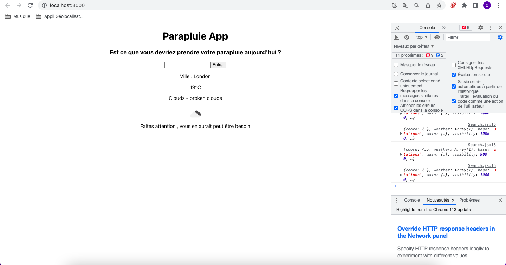
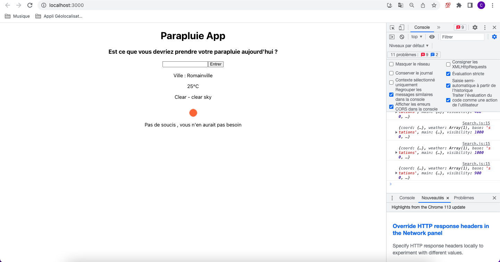

# Parapluie-App-React

Application qui vous donne la météo de n'importe quel ville , et vous indique si vous devriez prendre un parapluie ou non

## Usage

- Aller dans le dossier app
- Tapez la commande suivante :

```bash
npm start
```

## Stack Technique

- Framework : React
- API : OpenWeather

## Démonstration



